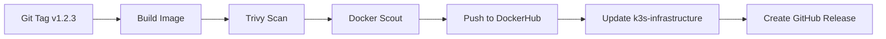

# 3X-UI Docker Image - CI Repository

> **🛠️ CI-ONLY Repository**  
> This repository builds optimized Docker images for 3X-UI VPN Panel.  
> Deployment is handled by [k3s-infrastructure](https://github.com/KomarovAI/k3s-infrastructure) via FluxCD.

---

## 🎯 Purpose

This repository is responsible for **Continuous Integration (CI)** only:

✅ Build optimized Docker images  
✅ Security scanning (Trivy + Docker Scout)  
✅ Push to DockerHub with semantic versioning  
✅ Auto-update image tags in k3s-infrastructure  

❌ **NO deployment** - handled by FluxCD in k3s-infrastructure

---

## 🚀 Quick Start

### 1. Create a new release

```bash
# Tag with semantic version
git tag v1.0.0
git push origin v1.0.0
```

**GitHub Actions will automatically:**
1. 🛠️ Build multi-stage Docker image
2. 🔒 Scan for vulnerabilities with Trivy
3. 📦 Push to DockerHub with multiple tags
4. 🔄 Update image tag in k3s-infrastructure
5. 🎉 Create GitHub Release with security report

### 2. FluxCD deploys automatically

FluxCD in k3s-infrastructure will detect the Git change and deploy within 1 minute.

---

## 📚 Repository Structure

```
3xui-k8s-statefulset/
├── .github/workflows/
│   └── build-scan-push.yml      # 🛠️ CI pipeline
├── scripts/
│   ├── entrypoint.sh            # Container entrypoint
│   └── healthcheck.sh           # Health check script
├── manifests/                   # 📌 Reference manifests only
│   ├── service.yaml
│   ├── ingressroute.yaml
│   └── networkpolicy.yaml
├── Dockerfile                   # Original Dockerfile
├── Dockerfile.optimized         # 🔥 Production-ready multi-stage
├── .dockerignore
└── README.md
```

---

## 🔥 Dockerfile Features

### Multi-stage Build

```dockerfile
Stage 1: base      → FROM ghcr.io/mhsanaei/3x-ui:latest
Stage 2: security  → apk upgrade + cleanup
Stage 3: runtime   → non-root user + scripts
```

### Security Hardening

✅ **Non-root user** (UID: 2000)  
✅ **Security updates** (apk upgrade)  
✅ **Minimal attack surface** (removed unnecessary packages)  
✅ **Read-only filesystem compatible**  
✅ **Health checks** built-in  

### Optimization

✅ **Layer caching** for faster builds  
✅ **BuildKit inline cache**  
✅ **Cleaned caches** (/tmp, /var/cache)  
✅ **OCI metadata labels**  

---

## 🔒 Security Scanning

### Trivy Vulnerability Scanner

**Scans for:**
- OS vulnerabilities (Alpine packages)
- Application dependencies
- Dockerfile misconfigurations
- Exposed secrets

**Severity levels:** CRITICAL, HIGH, MEDIUM

**Results uploaded to:**
- 📊 GitHub Security tab (SARIF format)
- 📄 GitHub Release artifacts (JSON report)

### Docker Scout

**Additional checks:**
- CVE database analysis
- Policy compliance
- Supply chain security

---

## 🏷️ Image Tagging Strategy

### Semantic Versioning

When you push a tag `v1.2.3`, the following Docker tags are created:

```
artur7892988/3xui-k8s-statefulset:v1.2.3   ← Specific version
artur7892988/3xui-k8s-statefulset:v1.2     ← Minor version
artur7892988/3xui-k8s-statefulset:latest   ← Latest release
```

### Production Recommendation

✅ **Use specific versions** in production:  
```yaml
image: artur7892988/3xui-k8s-statefulset:v1.2.3
```

❌ **Avoid `latest`** in production (unpredictable updates)

---

## 🔄 CI/CD Workflow

### Trigger Conditions

Workflow runs when:
- ✅ Git tag `v*.*.*` is pushed
- ✅ `Dockerfile*` is modified
- ✅ `scripts/**` is modified
- ✅ Manual trigger via GitHub Actions UI

Workflow **does NOT** run on:
- ❌ Regular commits to `main` without tags
- ❌ Documentation changes
- ❌ Manifest updates

### Pipeline Steps



1. **Checkout** repository
2. **Generate** Docker metadata (tags, labels)
3. **Build** multi-stage image with BuildKit
4. **Scan** with Trivy (CRITICAL/HIGH/MEDIUM)
5. **Analyze** with Docker Scout
6. **Push** to DockerHub with multiple tags
7. **Update** image tag in k3s-infrastructure Git
8. **Create** GitHub Release with Trivy report

---

## 🔧 Configuration

### Required Secrets

Configure in **Settings → Secrets and variables → Actions**:

| Secret | Description |
|--------|-------------|
| `DOCKERHUB_USERNAME` | DockerHub username |
| `DOCKERHUB_TOKEN` | DockerHub access token |
| `K3S_INFRA_PAT` | GitHub PAT for k3s-infrastructure |

### GitHub PAT Permissions

For `K3S_INFRA_PAT`, create a Personal Access Token with:
- ✅ `repo` (full control)
- ✅ `workflow` (update workflows)

---

## 📊 Image Metrics

Each build reports:
- 📦 **Image size** (MB)
- 🧱 **Number of layers**
- 🏷️ **Tags created**
- 🔐 **Digest** (SHA256)
- 🔒 **Vulnerabilities** found

View in **GitHub Actions → Build summary**

---

## 🛡️ Health Checks

### Docker HEALTHCHECK

```bash
# Runs every 30s, timeout 10s
/usr/local/bin/healthcheck.sh
```

**Checks:**
1. 3X-UI process is running
2. HTTP endpoint responds (port 2053)
3. Data directory exists and is writable

### Kubernetes Probes

Compatible with:
- `startupProbe` (90s grace period)
- `livenessProbe` (restart on failure)
- `readinessProbe` (remove from load balancer)

---

## 📝 Environment Variables

| Variable | Default | Description |
|----------|---------|-------------|
| `XUI_DATA_DIR` | `/etc/x-ui` | Data directory path |
| `XUI_PORT` | `2053` | Application port |
| `XUI_LOG_LEVEL` | `info` | Logging level |
| `POD_NAME` | - | Kubernetes pod name (injected) |
| `POD_NAMESPACE` | - | Kubernetes namespace (injected) |

---

## 🔗 Related Repositories

- **[k3s-infrastructure](https://github.com/KomarovAI/k3s-infrastructure)** - GitOps deployment via FluxCD
- **[3x-ui](https://github.com/MHSanaei/3x-ui)** - Upstream 3X-UI project

---

## 📜 License

MIT License - See [LICENSE](LICENSE) for details

---

## 👤 Maintainer

**Artur Komarov**  
📧 artur.komarovv@gmail.com  
🐙 [@KomarovAI](https://github.com/KomarovAI)

---

## 🎉 Status

🟢 **Active Development**  
📦 **DockerHub:** [artur7892988/3xui-k8s-statefulset](https://hub.docker.com/r/artur7892988/3xui-k8s-statefulset)  
🔒 **Security:** Trivy + Docker Scout scanning enabled  
🚀 **CI/CD:** Automated builds on Git tags
